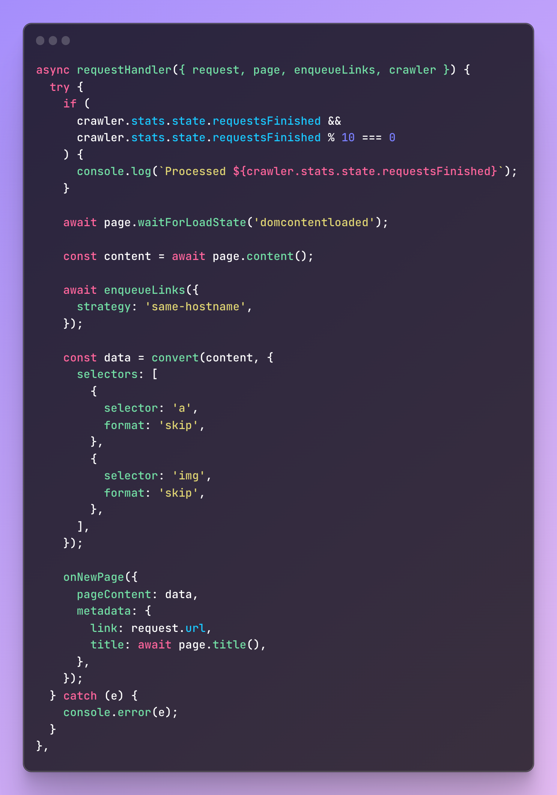
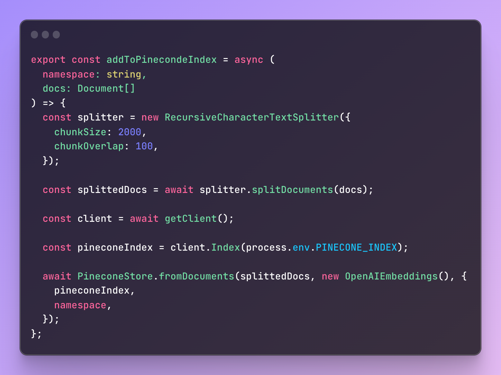
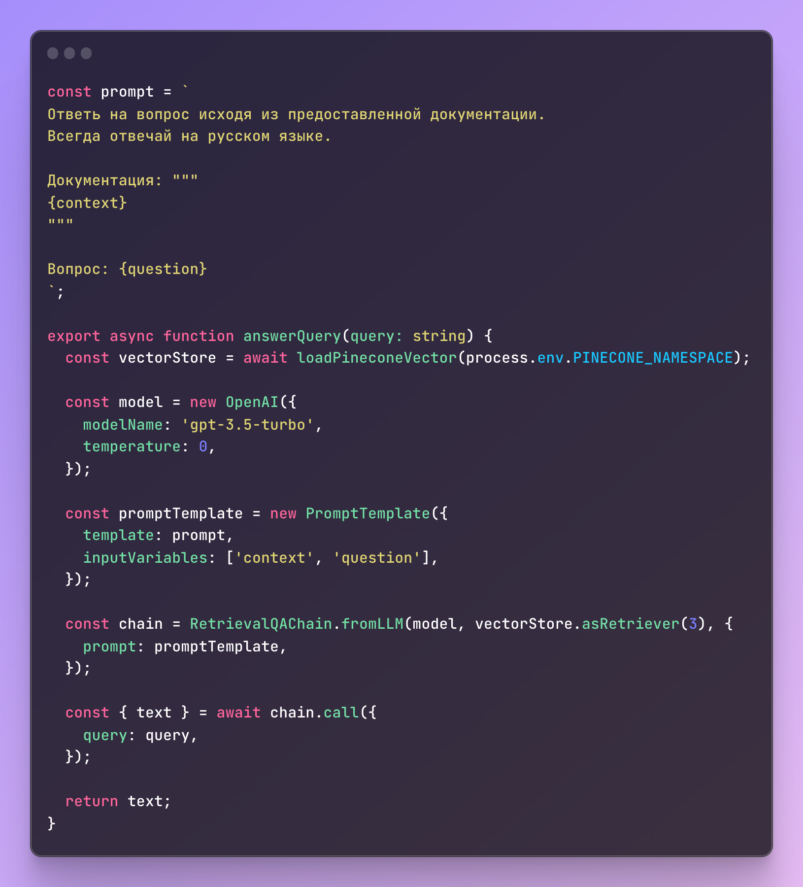

# Телеграм-бот на базе GPT

Проект представляет собой телеграм-бота, сканирующего ваши документы и отвечающего на вопросы по ним.

## Стек

- Node.js
- Langchain
- Pinecone
- OpenAI GPT
- Telegraf
- Crawlee
- TypeScript
- ESLint

## Обязательные требования

Для запуска проекта необходимы:

- Node.js 18+
- npm 9+

и аккаунты в следующих сервисах:

- Telegram
- [Pinecone](https://www.pinecone.io)
- [OpenAI](https://platform.openai.com/overview)

## Быстрый старт

1. Создайте телеграм-бота через [@BotFather](https://t.me/BotFather)
2. Создайте `.env` файл, скопируйте туда значения из файла `.env.example` и заполните их соответсвующими значениями.

   ```
   cp .env.example. .env
   ```

3. Выполните следующие команды

   ```
   npm install
   npm start
   ```

4. Откройте в телеграм вашего бота и выполните команду `/start`
5. Введите адрес веб-сайта, который необходимо проиндексировать
6. Дождитесь сообщения об успешной индексации
7. Задайте вопрос боту

## Как это работает

1. Бот принимает на вход адрес веб-сайта и индексирует его



2. На базе полученных данных строится индекс в Pinecone



3. Бот получает вопрос пользователя и строит ответ при помощи модели `gpt-3.5-turbo` в соответствии с заданным промптом.



## Переменные окружения

Бот работает автоматически подгружает переменные окружения из `.env` файла

## Реальные сценарии использования

- [Wikibot](https://wikibot.tomleto.pro)
- [Помощник по Excel](https://t.me/Excel_WikiBot) от Wikibot
